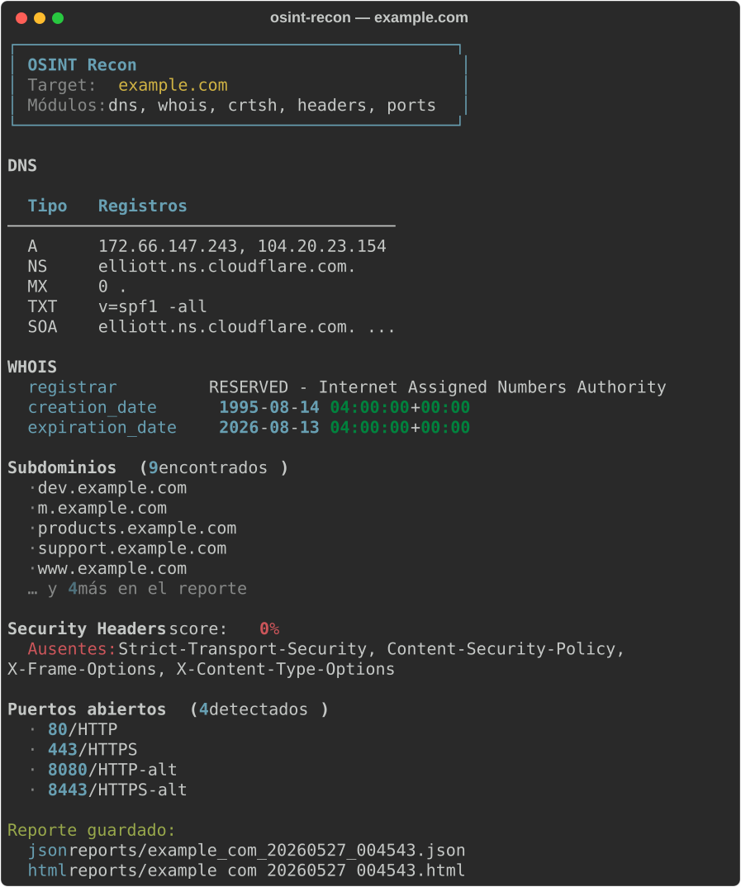
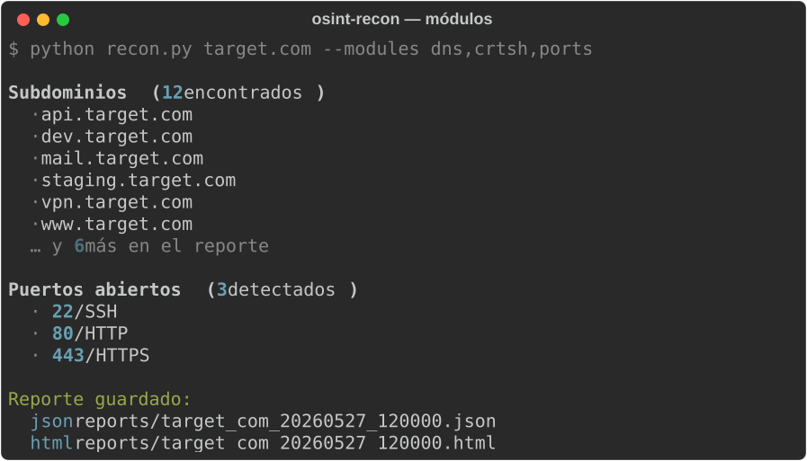

# osint-recon

Passive domain reconnaissance tool. Runs five modules in parallel — DNS, WHOIS, subdomain discovery via certificate transparency, HTTP security headers, and port scan — and exports structured JSON + HTML reports.

No SIEM, no paid APIs, no installation beyond Python.

> **Use only against infrastructure you own or have explicit written permission to test.**

---

## What it does

| Module | Source | What it finds |
|--------|--------|---------------|
| **dns** | System resolver | A, AAAA, MX, NS, TXT, CNAME, SOA records |
| **whois** | WHOIS servers | Registrar, dates, org, emails, name servers |
| **crtsh** | [crt.sh](https://crt.sh) (CT logs) | Subdomains from certificate transparency — passive, no target contact |
| **headers** | HTTP/HTTPS | Security header presence/absence + score (0–100%) |
| **ports** | TCP connect | 18 common ports; flags risky services (Telnet, SMB, RDP, Redis, MongoDB) |



---

## Install

```bash
git clone https://github.com/R-oyo/osint-recon
cd osint-recon
pip install -r requirements.txt
```

Requires Python 3.10+.

---

## Usage

```bash
# Scan all modules
python recon.py example.com

# Specific modules
python recon.py example.com --modules dns,crtsh,headers

# Custom output dir and format
python recon.py example.com --output /tmp/reports --format json

# Longer timeout for large domains (crt.sh can be slow)
python recon.py example.com --timeout 30
```

### Options

| Flag | Default | Description |
|------|---------|-------------|
| `--modules` / `-m` | all | Comma-separated: `dns,whois,crtsh,headers,ports` |
| `--output` / `-o` | `reports/` | Output directory for reports |
| `--format` / `-f` | `both` | `json`, `html`, or `both` |
| `--timeout` / `-t` | `10` | Seconds per module (increase for large domains) |

---

## Output

Each run saves two files in `reports/`:

```
reports/
└── example_com_20260527_120000.json   # Machine-readable, all raw data
└── example_com_20260527_120000.html   # Self-contained HTML report, dark theme
```

The HTML report includes summary cards, DNS table, WHOIS fields, subdomain list, security header score with visual bar, and open ports with risk tagging.



---

## Security headers score

Checks 7 headers: `Strict-Transport-Security`, `Content-Security-Policy`, `X-Frame-Options`, `X-Content-Type-Options`, `Referrer-Policy`, `Permissions-Policy`, `X-XSS-Protection`.

Score = (present / 7) × 100. Missing headers appear highlighted in the report.

## Port scan scope

Checks 18 common ports with parallel TCP connect. Flags five as high-risk when open:

| Port | Service | Why it's flagged |
|------|---------|-----------------|
| 23 | Telnet | Plaintext protocol |
| 445 | SMB | Common ransomware vector |
| 3389 | RDP | Exposed remote desktop |
| 6379 | Redis | Often runs unauthenticated |
| 27017 | MongoDB | Often runs unauthenticated |

---

## Project structure

```
osint-recon/
├── recon.py              # CLI — argument parsing, orchestration, terminal output
├── modules/
│   ├── dns_module.py     # DNS record enumeration via dnspython
│   ├── whois_module.py   # WHOIS lookup via python-whois
│   ├── crtsh_module.py   # Subdomain discovery via crt.sh API
│   ├── headers_module.py # HTTP security header analysis
│   └── portscan.py       # Parallel TCP port scan
├── reporter.py           # JSON + HTML report generation
└── reports/              # Output directory (gitignored except .gitkeep)
```

## Related tools

- [log-analyzer](https://github.com/R-oyo/log-analyzer) — detect attacks in auth.log, Windows Event Log, access.log
- [ticket-risk-tracker](https://github.com/R-oyo/ticket-risk-tracker) — track and escalate findings as risk tickets
- [security-ops-lab](https://github.com/R-oyo/security-ops-lab) — integrated dashboard combining log analysis, tickets, and compliance
